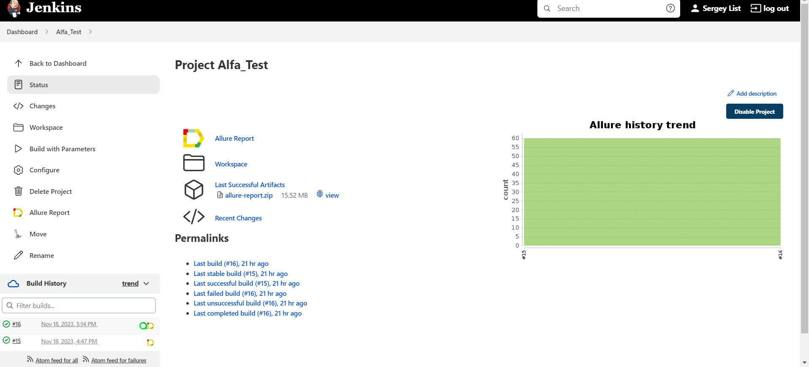
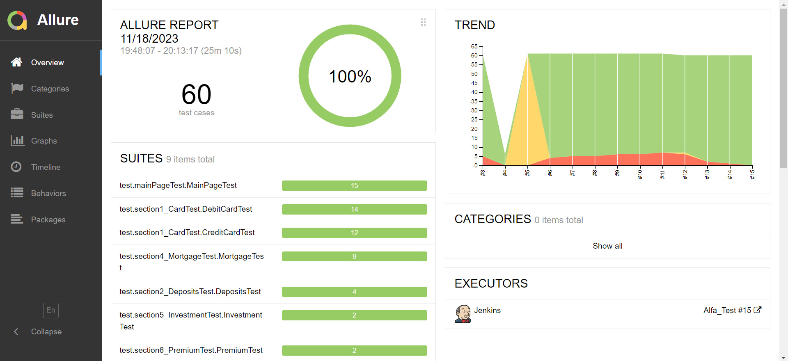
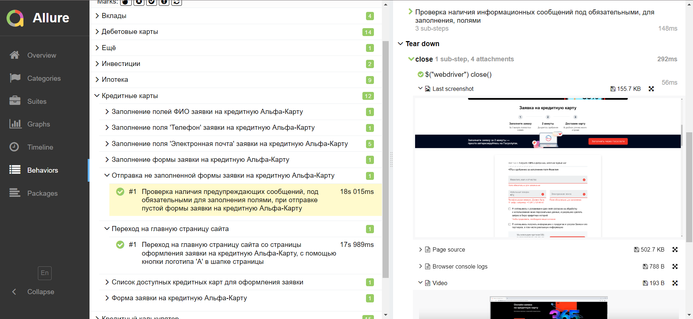
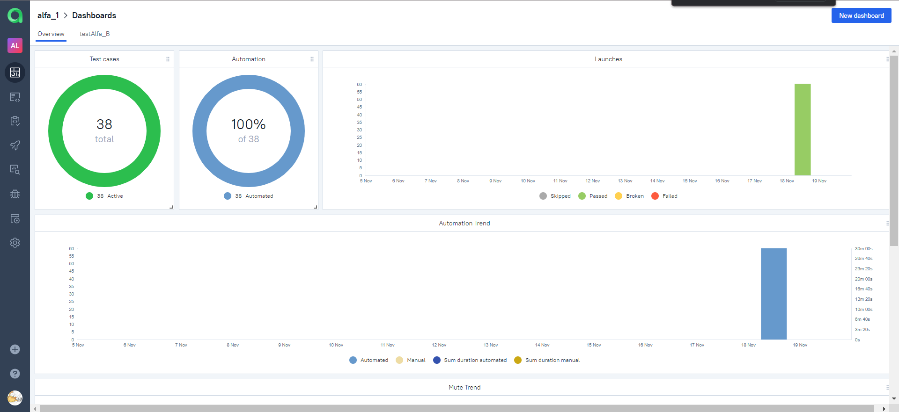
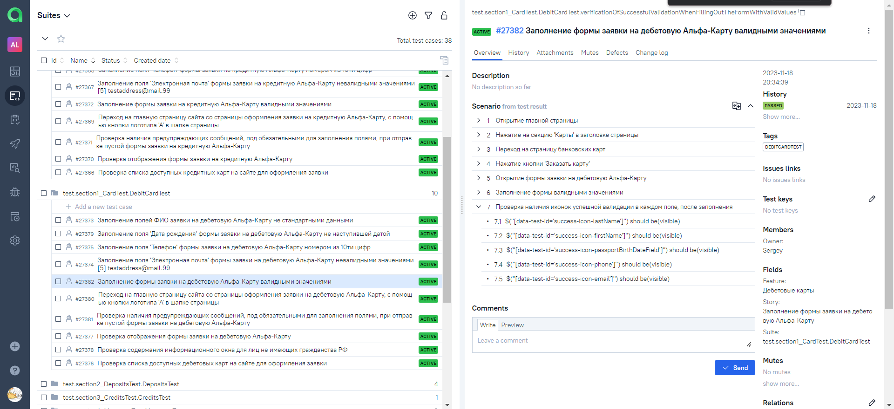
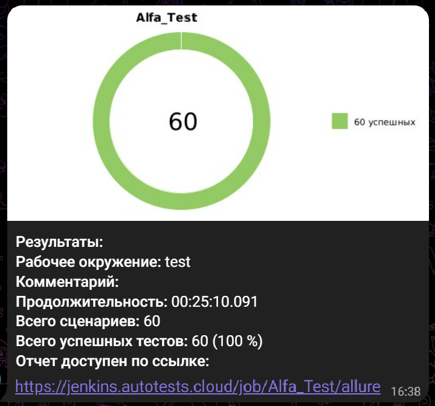
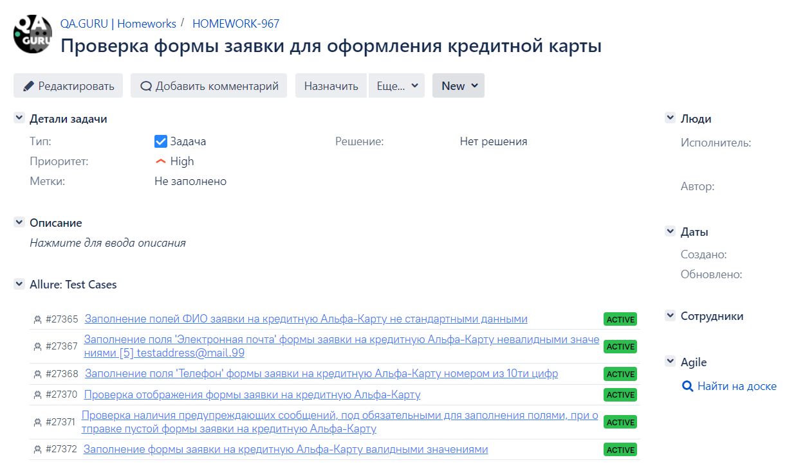
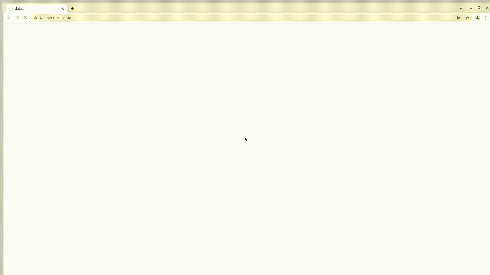

# Проект по автоматизации тестирования сайта alfabank.ru

<br>
<p align="center">

</p>
<br>

## :pushpin: Содержание:

- [Использованный стек технологий](#computer-использованный-стек-технологий)
- [Реализованные проверки](#computer-реализованные-проверки)
- [Запуск тестов](#running_woman-запуск-тестов)
- [Сборка в Jenkins](#-сборка-в-jenkins)
- [Пример Allure-отчета](#-пример-allure-отчета)
- [Интеграция с Allure TestOps](#-интеграция-с-allure-testops)
- [Уведомления в Telegram с использованием бота](#-уведомления-в-telegram-с-использованием-бота)
- [Видео примера запуска теста в Selenoid](#-видео-примера-запуска-теста-в-selenoid)

## :computer: Использованный стек технологий

<p align="center">


</p>

Автотесты написаны на <code>Java</code> с использованием <code>JUnit 5</code> и <code>Gradle</code>.
Для UI-тестов использован фреймворк [Selenide](https://selenide.org/).
Запуск тестов можно осуществлять локально или с помощью [Selenoid](https://aerokube.com/selenoid/).
Также реализована сборка в <code>Jenkins</code> с формированием Allure-отчета и отправкой уведомления с результатами в <code>Telegram</code> после завершения прогона.

Allure-отчет включает в себя:
* шаги выполнения тестов;
* скриншот страницы в браузере в момент окончания автотеста;
* Page Source;
* логи браузерной консоли;
* видео выполнения автотеста.

## :computer: Реализованные проверки

- [x] *Проверка рассчёта кредитного калькулятора на главной странице*
- [x] *Проверка секции карты: кредитные, дебетовые*
    - форма для оформления заявки на выбранную карту
- [x] *Проверка секции вклады: доступные для оформления*
- [x] *Проверка секции кредиты: информация по кредитам*
- [x] *Проверка секции ипотека: предлагаемые варианты, условия оформления*
- [x] *Проверка секции Инвестиции*
- [x] *Проверка секции Премиум: оформление карты 'Премиум'*
- [x] *Проверка модального окна, при наведении на секцию 'Ещё'*

## :running_woman: Запуск тестов

### Локальный запуск тестов
```
gradle clean test -Denv=local
```

При необходимости можно переопределить параметры запуска
```
test - запуск всех тестов
main_test - запуск тестов на главной странице (рассчёт ежемесячного платежа по кредиту)
creditCard_test - запуск тестов в блоке Карты: секция кредитные карты
debitCard_test - запуск тестов в блоке Карты: секция дебетовые карты
deposits_test - запуск тестов в блоке Вклады
credits_test - запуск тестов в блоке Кредиты
mortgage_test - запуск тестов в блоке Ипотека
investment_test - запуск тестов в блоке Инвестиции
premiumCard_test - запуск тестов в блоке Премиум
modalWindow_test - кнопка Ещё

```

### Запуск тестов на удаленном браузере
```
gradle clean test -Denv=remote
```
При необходимости также можно переопределить параметры запуска

```
test - запуск всех тестов
main_test - запуск тестов на главной странице (рассчёт ежемесячного платежа по кредиту)
creditCard_test - запуск тестов в блоке Карты: секция кредитные карты
debitCard_test - запуск тестов в блоке Карты: секция дебетовые карты
deposits_test - запуск тестов в блоке Вклады
credits_test - запуск тестов в блоке Кредиты
mortgage_test - запуск тестов в блоке Ипотека
investment_test - запуск тестов в блоке Инвестиции
premiumCard_test - запуск тестов в блоке Премиум
modalWindow_test - кнопка Ещё
```

##  <a href=""> Локальный запуск</a>
<p align="center">


</p>

##  <a href="https://jenkins.autotests.cloud/job/Alfa_Test/15/"> Сборка в Jenkins</a>
<p align="center">

</p>

##  <a href="https://jenkins.autotests.cloud/job/Alfa_Test/15/allure/">Пример Allure-отчета</a>
### Overview

<p align="center">

</p>

### Результат выполнения теста

<p align="center">

</p>

##  Интеграция с [Allure TestOps](https://qameta.io/)

### Основной дашборд

<p align="center">
  
</p>

### Тест-кейсы

<p align="center">
  
</p>


###  Уведомления в Telegram с использованием бота

После завершения сборки специальный бот, созданный в <code>Telegram</code>, автоматически обрабатывает и отправляет сообщение с отчетом о прогоне.

<p align="center">

</p>

# Интеграция с Jira
<p align="center">
  
</p>

###  Видео примера запуска теста в Selenoid

К каждому тесту в отчете прилагается видео. Одно из таких видео представлено ниже section1 > CreditCardTest > Отправка не заполненной формы заявки на кредитную Альфа-Карту.
<p align="center">
  
</p>